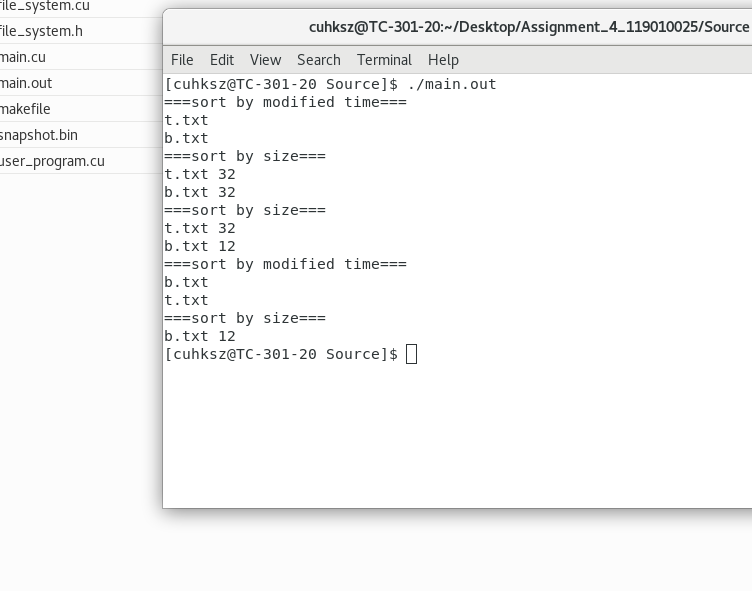
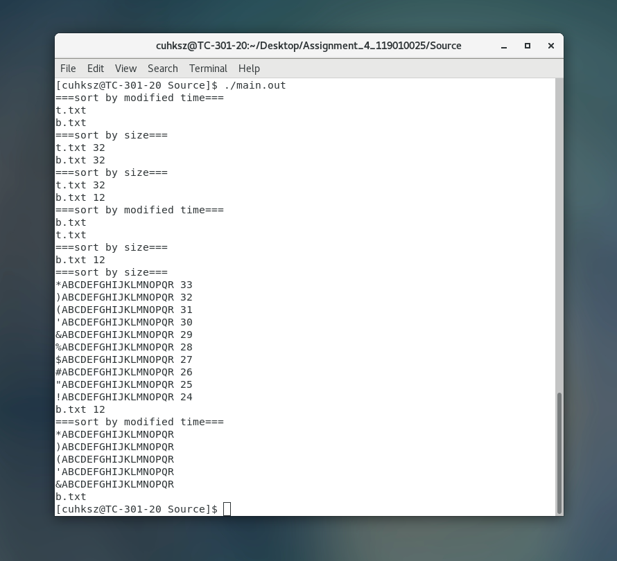
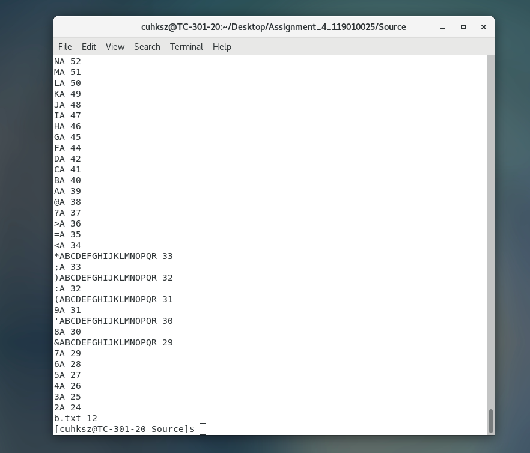
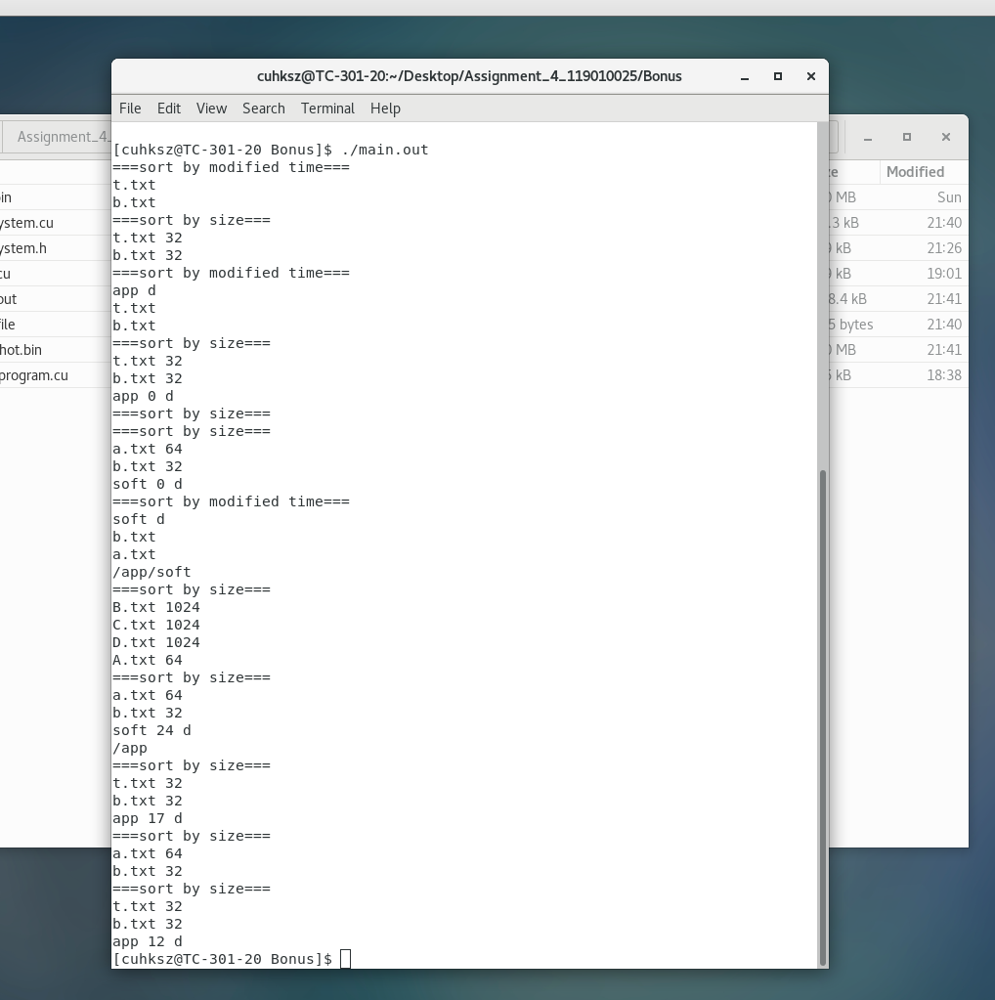

# Report

> Name: 陈秋泓
>
> Data: 2021.11.23
>
> Student ID: 119010025
>
> ==All bonus completed.==

## Environment: centOS

#### OS Version

```shell
# OS Version
$ cat /etc/redhat-release
CentOS Linux release 7.6.1810 (Core)

# Kernel Version
$ uname -s -r
Linux 3.10.0-957.21.3.el7.x86_64
```

#### CUDA Version

```shell
$ nvcc -V
nvcc: NVIDIA (R) Cuda compiler driver
Copyright (c) 2005-2019 NVIDIA Corporation
Built on Fri_Feb__8_19:08:17_PST_2019
Cuda compilation tools, release 10.1, V10.1.105
```

#### GPU Information

```shell
$ nvidia-smi
Wed Nov 10 19:44:14 2021       
+-----------------------------------------------------------------------------+
| NVIDIA-SMI 430.34       Driver Version: 430.34       CUDA Version: 10.1     |
|-------------------------------+----------------------+----------------------+
| GPU  Name        Persistence-M| Bus-Id        Disp.A | Volatile Uncorr. ECC |
| Fan  Temp  Perf  Pwr:Usage/Cap|         Memory-Usage | GPU-Util  Compute M. |
|===============================+======================+======================|
|   0  GeForce GTX 106...  Off  | 00000000:01:00.0  On |                  N/A |
| 37%   38C    P5     8W / 120W |    203MiB /  6078MiB |      9%      Default |
+-------------------------------+----------------------+----------------------+
                                                                               
+-----------------------------------------------------------------------------+
| Processes:                                                       GPU Memory |
|  GPU       PID   Type   Process name                             Usage      |
|=============================================================================|
|    0      2163      G   /usr/bin/X                                   102MiB |
|    0      3359      G   /usr/bin/gnome-shell                          96MiB |
|    0     16021      G   /usr/lib64/firefox/firefox                     1MiB |
+-----------------------------------------------------------------------------+
```

## Execution

### Build and Run

The makefile is provided for execution.

```shell
$ make  # to build
$ make clean # to clean executables
$ ./main.out # to run
```

<u>There are 2 folders (`Source` and `Bonus`), which correspond to basic scores and bonus. They both have makefile.</u> 

### Output

All test cases can run on the bonus program.

Here I use `basic program` and `bonus program` to run user program separately. They all get the correct output.










## Design

The structure of this file system basically includes 4 storage sections:

1. Super block. `4KB`
2. FCB. `32KB` (for the bonus part, I extent this part to `34KB`)
3. Data block. `1024KB`
4. Directory structure. `4KB`

In the basic part, the previous 3 are implemented.

In the bonus part, the last one is implemented additionally.

### Data Structure Overview

The program is allocated with `1060KB` device memory for basic part implementation (for the bonus part, I allocate 6KB additional space). A lot of pointers are pointing towards this region in the file system. I use `C struct` to organize these pointers and implement data structures in this space.

```C
struct FileSystem {
	uchar* volume;
	BitMap* bitmap;
	FCB* fcb[1024];
	FCB* root_FCB;
	STACK* FCB_stack;
	EDGE* edge[1024];
    ... // constants
};
```

The `FCB` struct, which is `32B` (`34KB` for bonus), is used to maintain `File Control Block`.  There are `1024` FCB instances.

The `EDGE` struct, which is `4B`, is used to maintain `directory tree structure`. There are `1024` EDGE instances.

The `BitMap` struct, which is `4KB`, is used to maintain `Free Space List`. It also encapsulate a few methods for bit operation.

The `STACK` struct is a stack implementation used for `current directory path`.

**The `FileSystem` contains all pointers to these data structures, which makes coding ==readable== and ==easy to maintain==.**

### File Control Block

```C
struct FCB { // 34B, bonus
	char filename[20]; // 20B
	u16 FCB_idx; // 2B
	u16 modified_time; // 2B
    u16 created_time; // 2B
	u16 size; // 2B
	u16 starting_block; // 2B
	u16 first_edge_idx; //  2B
	u8 allocated_blocks; // 1B 
	u8 open_mode; // 1B
};
```

`FCB` store metadata of a file, which includes:

| Variable         | Meaning                                                      |
| ---------------- | ------------------------------------------------------------ |
| filename         | file name                                                    |
| FCB_idx          | index of the FCB block, similar to inode  number             |
| created_time     | the time to create the file (or directory)                   |
| modified_time    | the last modified time                                       |
| size             | size of the file in bytes (or the size of content filenames<br />for a directory) |
| starting_block   | the starting block of the file                               |
| first_edge_idx   | (only to directory-type FCB) the first file in the directory |
| allocated_blocks | allocated blocks of the file (not “used blocks”)             |
| open_mode        | can be DIR / G_READ / G_WRITE                                |

### Directory

The directory uses a tree structure, which I maintain using `Adjacent List`. A directory is treated the same as a file.


```C
struct EDGE {
	u16 FCB_idx;
	u16 next_edge;
};
```

As the directory is originally a `forest`, I create a FCB for the root directory, which makes the graph a standard tree for easy operation.

The current path is implemented using a stack, whose top element is the current directory. When program inits, the top element is the root directory.

### Free Space Management

File system maintains `Free Space List` to track available blocks. This infomation in stored in the `super block`.

I use `bitmap` to implement this function, with `BitMap` struct to store the bitmap.


 ```c
 struct BitMap {
 	u32 data[1024];
 	inline __device__ bool is_free(u32 bit_idx);
 	inline __device__ bool set_free(u32 bit_idx);
 	inline __device__ bool set_allocated(u32 bit_idx);
 	__device__ void init();
 	__device__ u32 FindFree(u32 start_bit_idx);
 	__device__ u32 FindAllocated(u32 start_bit_idx);
 };
 ```

Each data block is `32B`. I use a function to interpret the data block index to the address.

```c
__device__ uchar* DataBlockIdx_ptr(FileSystem* fs, u32 block_idx)
```

### File Creation & File Write

`File Open` and `File Read` is easy to implement with these data structures and algorithms. I will explain `File Creation`, `File Write` and `FIle Delete` in detail.

When a new file is created, the file system allocates `1024B` space in the data block region, which is `32` data blocks. The free space map is updated accordingly, with 32 bits in the free space map being set to `ALLOCATED`. The user program writes to the file, and at the end of the write operation (`fs_write()`), I implement `fs_close()` function to close the file. In `fs_close()`, the file system shrinks the allocated blocks to the appropriate size, and change bitmap accordingly.

```c
__device__ u32 fs_close(FileSystem* fs, u32 fp);
```

If no space is found, the file system will `compact` the file data storage, which cleans all external fragmentations.

In real OS practice, compact is done by (1) copy the disk content to another disk (2) clear the current disk (3) recover the content of the current disk from the other disk. In my implementation, I sort all FCBs according to their starting data block index, and move each continuous file to one end in order, This process is done by `Block_Migrate()`.

For directory creation, there is no need to allocate data blocks.

The file system then retries to find 32 blocks. This time, an error will raise if no space found.

```c
__device__ void compact(FileSystem* fs);
```

```c
__device__ void Block_Migrate(FileSystem* fs, u16 dst_block_idx, u16 src_block_idx);
```

### File Delete

The delete of the file requires to free the data blocks and update the bitmap. Moreover, if the file is a directory, we should recursively do the deletion. To be specific, a directory can only be deleted if its contents are all deleted.

```c
__device__ void remove_dir(FileSystem* fs, FCB* parent_FCB, FCB* t_FCB)
{
	assert(t_FCB != NULL);
	assert(t_FCB->open_mode == DIR);
	for (u16 edge_idx = t_FCB->first_edge_idx; edge_idx != EDGE_IDX_NULL; edge_idx = fs->edge[edge_idx]->next_edge)
	{
		FCB* child_FCB = fs->fcb[fs->edge[edge_idx]->FCB_idx];
		if (child_FCB->open_mode == DIR)
		{
			remove_dir(fs, t_FCB, child_FCB); // remove file
		}
		else
		{
			remove_file(fs, t_FCB, child_FCB); // recursively delete directory
		}
	}
    // delete the current directory in the end
	RESET_FCB(t_FCB);
	delete_in_directory(fs, parent_FCB, t_FCB->FCB_idx); 
}
```

### Other operations

`PWD`  and `CD_P` only need to use and update the `path infomation` stored in the `stack`.

`LS_D` and `LS_S` need to sort all files in the current directory. I specify the following comparison algorithms and use CUDA’s sort function to do the sorting.

```c
__host__ __device__ bool FCB_modified_time_cmp(const FCB* o1, const FCB* o2)
{
	return (o1->modified_time == o2->modified_time) ? (o1->created_time < o2->created_time) : (o1->modified_time > o2->modified_time);
}

__host__ __device__ bool FCB_size_cmp(const FCB* o1, const FCB* o2)
{
	return (o1->size == o2->size) ? (o1->created_time < o2->created_time) : (o1->size > o2->size);
}
```


```C
struct STACK
{
	FCB* data[5];
	u8 cnt=0;
	inline __device__ FCB* top();
	inline __device__ void push(FCB* t_FCB);
	inline __device__ void pop();
};
```

## Problems & Solutions

### #1 Pointer Cast Error

In user program, `fs_open()` returns a `u32` type value. At first, I thought it is the pointer of the FCB.

```c
u32 fp = fs_open(fs, "t.txt\0", G_WRITE);
```

Some error occurs when I use this pointer,. Then I realize my comuter is 64-bit. Then I change the return value to the index of the FCB.

### #2 CUDA Kernel throws C Library Error

When I try to use `string.h` and some other c standard libraries, NVCC will throw an error (calling host function from device is not allowed).

I realize some c standard libraries are not supported. I write my own functions for string operation.

```C
__device__ u16 my_strlen(const char* x);
__device__ bool my_strcmp(const char* x, const char* y);
__device__ void my_strcpy(char* dest, const char* src);
__device__ void my_memclean(uchar* dst, size_t count);
__device__ void my_memcpy(uchar* dst, uchar* src, size_t count);
```

### #3 Stack Memory not enough

When I write recursive function for `RM_RF`, program does not output.

I check stackoverflow and add the following setting in the host function.

```c
cudaDeviceSetLimit(cudaLimitStackSize, 32768);
```

This issue is often encountered and causes the program to have no output.

## Learning Outcome

From this project, I learnt the following:

1. how to implement a simple file system
2. how to implement simple shell command for the file system
3. how to implement directory structure
